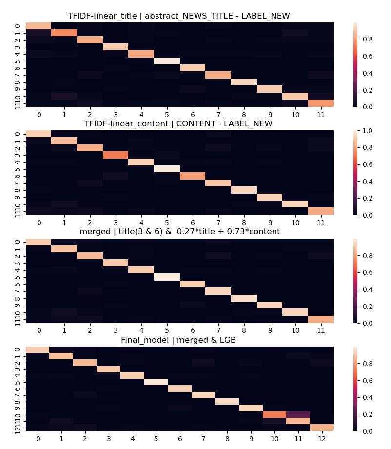

# 一、舆情识别模型
## TFIDF-岭回归分类器
将'被监管机构罚款或查处', '被采取监管措施' 合并为一类，训练11类的线性分类器（岭回归）。
- 标题 训练一个模型(linear_t)
- 文章内容 训练一个模型(linear_c)

## LGB模型
'被监管机构罚款或查处', '被采取监管措施'两类训练一个二分类模型(lgb_clf)

## 模型融合
- 融合1：linear_t预测为3，6 + 0.27 * linear_t + 0.73 * linear_t 模型
- 融合2：融合1预测为10的样本再用lgb预测分为2类
  
