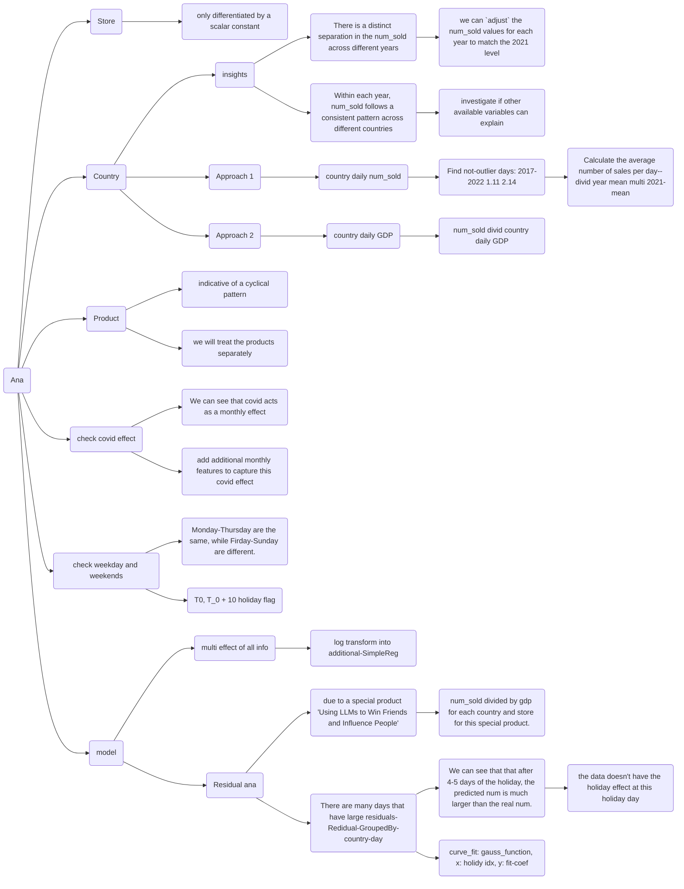

```mermaid
graph LR;

Start(Ana)
--> A1(Store) --> AFind(only differentiated by a scalar constant)

Start --> A2(Country) --> A2insights(insights)
A2insights --> a2Find(There is a distinct separation in the num_sold across different years)
--> a2approaches(we can `adjust` the num_sold values for each year to match the 2021 level)

A2insights --> a2Find2(Within each year, num_sold follows a consistent pattern across different countries)
--> a2approaches2(investigate if other available variables can explain)

A2 --> A2Approach1(Approach 1)
A2Approach1 --> specialNormalize1(country daily num_sold)
--> specialNormalize2(Find not-outlier days: 2017-2022 1.11 2.14)
--> specialNormalize3(Calculate the average number of sales per day--divid year mean multi 2021-mean)

A2 --> A2Approach2(Approach 2) 
A2Approach2 --> specialNormalize4(country daily GDP) --> specialNormalize5(num_sold divid country daily GDP)

Start --> A3(Product) --> A3insights1(indicative of a cyclical pattern)
A3 --> A3insights2(we will treat the products separately)

Start --> A4(check covid effect) --> A4insights1(We can see that covid acts as a monthly effect)
A4 --> A4insights2(add additional monthly features to capture this covid effect)

Start --> A5(check weekday and weekends) --> A5insights1(Monday-Thursday are the same, while Firday-Sunday are different.)
A5 --> A5insights2(T0, T_0 + 10 holiday flag)


Start --> B1(model) --> B1M(multi effect of all info) --> B1M2(log transform into additional-SimpleReg)
B1 --> Ana(Residual ana) --> AnaFind1(due to a special product 'Using LLMs to Win Friends and Influence People')
AnaFind1 --> AnaFind1Detail(num_sold divided by gdp for each country and store for this special product.)

Ana --> AnaFind2(There are many days that have large residuals-Redidual-GroupedBy-country-day)
--> AnaFind2Detail(We can see that that after 4-5 days of the holiday, the predicted num is much larger than the real num.)
--> AnaFind2DetailReason(the data doesn't have the holiday effect at this holiday day)
AnaFind2 --> AnaFind2DetailFit( curve_fit: gauss_function, x: holidy idx, y: fit-coef)

```